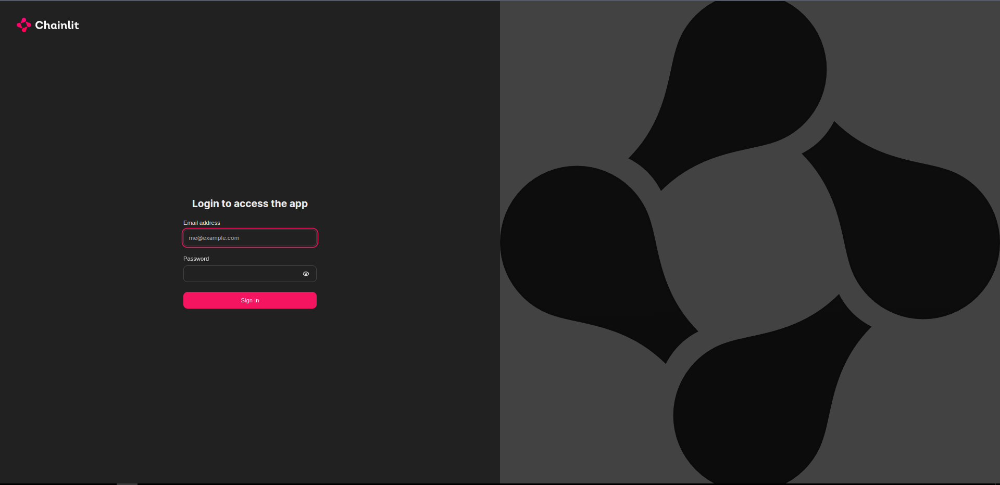
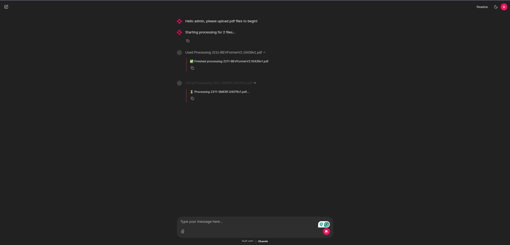
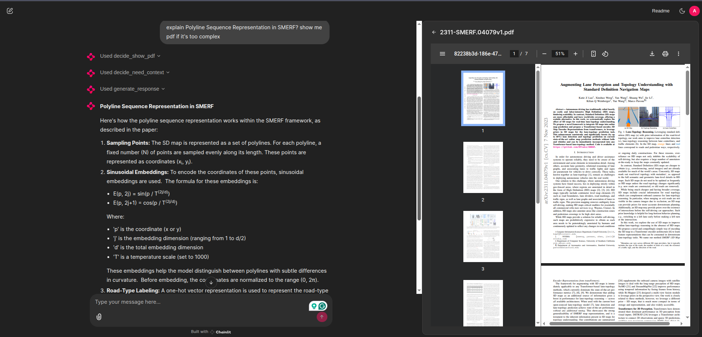

# pRAG

pRAG is an production-ready fully local question-answering system specifically designed scientific documentation. It leverages state-of-the-art retrieval-augmented generation (RAG) techniques to help students, researchers, and academics efficiently extract and synthesize information from academic papers and documents.

## Features

- **Document Processing**: Upload and process multiple PDF files simultaneously with RAY
- **Advanced RAG Pipeline**: 
  - Vector-based document retrieval using Qdrant
  - Context-aware response generation
  - PDF content display and reference
- **User Authentication**: Secure admin access with password protection
- **VectorDB**: Using Qdrant with docker to avoid InMemory 
- **Chat Interface**: Interactive chat-based interface powered by Chainlit
- **Multi-Model Support**: Integration with various LLM providers (DeepSeek, OpenAI, Google)
- **Docker Support**: Containerized deployment with Docker and docker-compose

## Project Structure

- **Core Components**:
  - `app.py`: Main application logic and Chainlit interface
  - `db.py`: Vector database management and document processing
  - `config.py`: Configuration management and API keys
  - `chain.py`: RAG pipeline implementation

## Setup

1. **Prerequisites**:
   - Docker and Docker Compose
   - Python 3.8+
   - NVIDIA GPU

2. **Environment Setup**:
   ```bash
   # Clone the repository
   git clone https://github.com/KSonPham/pRAG.git
   cd pRAG

   # Create .env file with required environment variables
   cp .env.example .env
   # Create chainlit-secret:
   chainlit create-secret
   # Edit .env with your chainlit security key
   ```

3. **Docker Deployment**:
   ```bash
   docker-compose up -d
   ```

4. **Local Development**:
   ```bash
   pip install -r requirements.txt
   python app.py
   ```

## Usage

1. Access the application through your web browser
2. Log in with admin/admin credentials
   
3. Upload PDF documents for processing
   
4. Ask questions about the uploaded documents
   
5. View relevant PDF sections and generated answers

## Security Notes

- The application uses bcrypt for password hashing
- API keys are stored in the configuration file
- Admin access is protected by password authentication

## Advanced Features

- **Multi-Document Analysis**: Cross-document question answering
- **Context-Aware Responses**: Intelligent context retrieval and synthesis
- **PDF Display**: Interactive PDF viewing with relevant sections highlighted

## Contributing

Contributions are welcome! Please feel free to submit a Pull Request.


